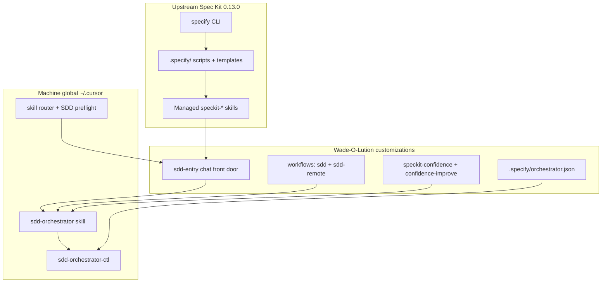

# Spec Kit / SDD docs

**When to use this folder:** adopting or operating SDD in a product repo.  
**Working daily in meeting_notes?** Prefer that repo’s `docs/agents/SDD_USER_GUIDE.md`.  
**Machine not set up yet?** [../day1.md](../day1.md) first (Spec Kit CLI is optional there).

## Layers (one picture)

| Surface | Command / verb | Who owns gating |
|---------|----------------|-----------------|
| **Chat** | `Start SDD` / `Continue SDD` | `sdd-entry` → **`sdd-orchestrator`** (`auto_chain`) |
| **CLI interactive** | `specify workflow run sdd …` | Workflow sequencing + orchestrator `single_phase` |
| **CLI headless** | `sdd-run --from-phase … --to-phase …` | Orchestrator control plane only |

Bare `speckit-*` skills are **workers**, not a front door. Upstream bundled `speckit` workflow stays installed but is **not** for daily use.

## Reading order

| Order | Doc | Role |
|-------|-----|------|
| 1 | [bootstrap.md](./bootstrap.md) | Adopt once (`cursor-setup adopt-sdd`) |
| 2 | [quick-start.md](./quick-start.md) | Daily chat + CLI recipes |
| 3 | [phase-model.md](./phase-model.md) | Canonical phase order + confidence contract |
| — | [orchestrator.md](./orchestrator.md) | Invoke / configure ctl |
| — | [troubleshooting.md](./troubleshooting.md) | Symptom → fix |
| — | [remote-handoff.md](./remote-handoff.md) | Laptop → Mac mini |

Templates: [../../templates/spec-kit/](../../templates/spec-kit/)
