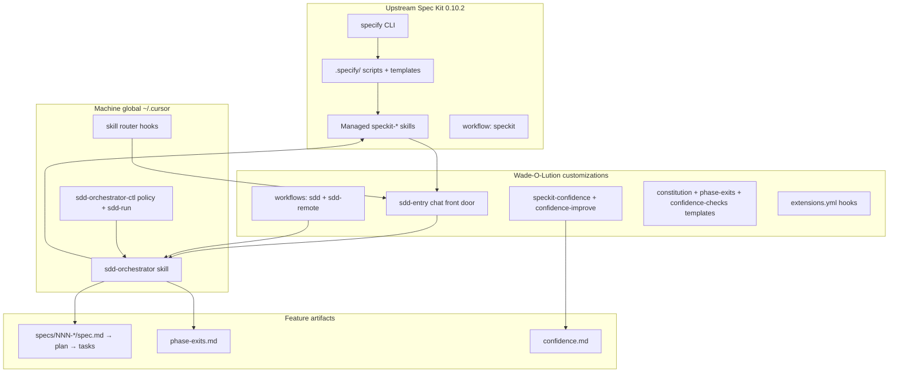

# Overview — Spec Kit vs Wade-O-Lution layers

## Three surfaces

| Surface | Command / verb | Who owns gating |
|---------|----------------|-----------------|
| **Chat** | `Start SDD: …` / `Continue SDD` | `sdd-entry` → **`sdd-orchestrator`** per phase |
| **CLI interactive** | `specify workflow run sdd …` | Workflow YAML human gates + orchestrator preamble on each step |
| **CLI headless** | `sdd-run --from-phase … --to-phase …` | Orchestrator control plane only (no workflow gates) |

Bare `speckit-*` skills are **workers**. They are not a front door.

## What upstream Spec Kit gives you

After `specify init . --integration cursor-agent --here --script sh`:

- `.specify/scripts/bash/` — feature branch + plan/tasks helpers
- `.specify/templates/` — spec, plan, tasks, checklist, constitution templates
- `.cursor/skills/speckit-{specify,clarify,plan,tasks,analyze,implement,constitution,checklist,taskstoissues}/`
- Bundled workflow **`speckit`**: specify → plan → tasks → implement (2 human gates only)
- Optional **`agent-context`** extension (refresh SPECKIT block in a rule file)
- Preset catalog cache under `.specify/presets/.cache/`

## What we added (org)

| Layer | Customization |
|-------|----------------|
| Workflows | **`sdd`**, **`sdd-remote`** with flags — [templates/spec-kit/](../templates/spec-kit/) |
| Chat entry | **`sdd-entry`** — [templates/skills/sdd-entry/](../templates/skills/sdd-entry/) |
| Phase exits | Binary gates in six phase skills + `phase-exits-template.md` |
| Confidence | **`speckit-confidence`**, **`confidence-checks`**, learning log, **`speckit-confidence-improve`** — templates in [../templates/skills/](../templates/skills/) |
| Constitution | Compiled from `.cursor/rules/`; SDD quality gates 1–6 |
| Extensions | `after_specify` / `after_plan` → agent-context; `after_implement` → confidence; `after_confidence` → improve — [extensions.yml.template](../templates/spec-kit/extensions.yml.template) |
| Remote | `sdd-remote` + `remote-agent-handoff` + handoff scripts |
| Global | Multi-model **`sdd-orchestrator`** + **`sdd-orchestrator-ctl`** |

## What we deliberately did *not* change

- Spec Kit CLI engine / hash manifests
- Upstream bundled `speckit` workflow (left installed, **undocumented** for daily use)
- Enabling orchestrator `shadow` / `epsilon` (stay off until Slice D human GO)

Next: [quick-start.md](./quick-start.md) · [managed-vs-custom.md](./managed-vs-custom.md)
